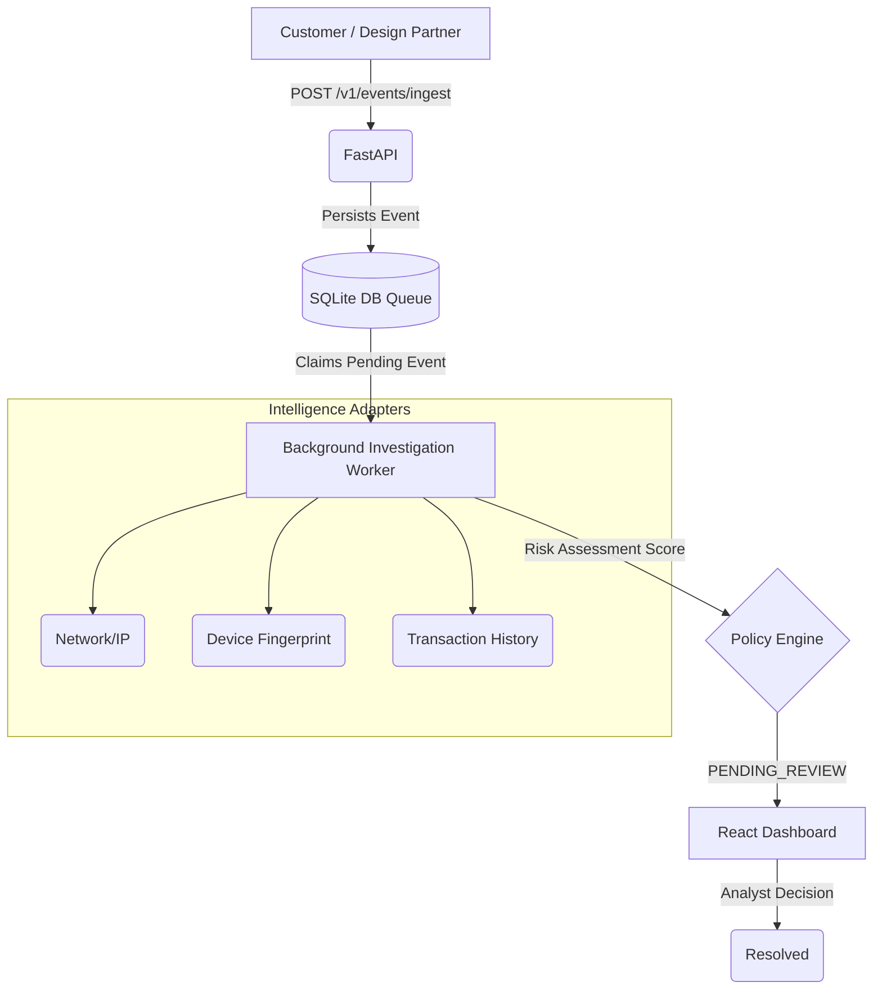

<div align="center">
  
  
  # 🛡️ RiskPilot AI
  
  **RiskPilot recommends. The analyst decides.**
  
  *An intelligent, event-driven fraud investigation platform designed to slash manual review times from 25 minutes to 1 minute.*

  [](https://www.python.org/)
  [](https://fastapi.tiangolo.com/)
  [](https://reactjs.org/)
  [](LICENSE)
</div>

<hr/>

## 📖 What is RiskPilot?

Fraud and risk analysts spend significant time manually gathering evidence across multiple systems before making a decision. 
RiskPilot automatically gathers and correlates investigation evidence, applies deterministic risk scoring and policy rules, and presents the result to a human analyst through an AI Copilot.

✨ **Key Features:**
- ⚡ **True Event-Driven Microservices:** Zero monolithic background tasks. API decoupled from Worker processing.
- 🤖 **AI Copilot Synthesis:** Summarizes massive evidence graphs into human-readable narratives.
- 🔒 **Safe Concurrency:** Built-in lock management for reliable SQLite multi-worker polling.
- 🔌 **100% Real API Integrations:** Drop in your keys for OpenAI and IPInfo to run real live investigations.

---

## 🏗️ Architecture Flow



---

## 🚀 Quick Start Guide

### 1. Configure your Environment
Copy the example environment file and optionally add your premium API keys.
```bash
cp .env.example .env
```
*(Note: If you leave the keys blank, the system gracefully falls back to deterministic mocks and free unauthenticated API tiers!)*

### 2. Start the Backend API
Run the FastAPI server on port 8000:
```bash
python -m uvicorn apps.api.app.main:app --port 8000
```

### 3. Start the Background Worker
Open a new terminal and start the async investigation worker:
```bash
python -m workers.investigation.main
```

### 4. Start the Dashboard UI
Open a third terminal for the React dashboard:
```bash
cd apps/dashboard
npm install
npm run dev
```
Navigate to `http://localhost:5173` to view the beautiful dashboard!

---

## 🧪 Triggering a Live Case

Want to see it in action? Run the live case trigger script.
```bash
python tools/trigger_live_case.py
```
Watch your terminal as the API ingests the event, the background worker picks it up, queries live IP addresses, calculates a risk score, and pushes it to the dashboard for human review!

---

## 📊 The Technology Stack

| Component | Technology | Description |
|-----------|------------|-------------|
| **API Layer** | FastAPI + Pydantic | High-performance async ingestion |
| **Worker Engine** | AsyncIO + Python | Reliable background polling mechanism |
| **Database** | SQLite + SQLAlchemy | Strict relational data models |
| **Dashboard** | React + Vite | Clean, component-based Analyst UI |
| **AI Copilot** | OpenAI (GPT-4o) | Evidence summarization and chat |
| **Geospatial** | IPInfo / IP-API | Live IP/ASN intelligence adapters |

---

## 🔒 Security & Reliability

- **Tenant Isolation**: All database queries are explicitly filtered by `organization_id`.
- **Graceful Degradation**: If the LLM provider fails, the Copilot automatically falls back to deterministic rule-based explanations without interrupting the system.
- **Least Privilege**: The Copilot only has read access to evidence and cannot modify risk scores or execute policies.

---
<div align="center">
<i>Built for the modern risk analyst.</i>
</div>
