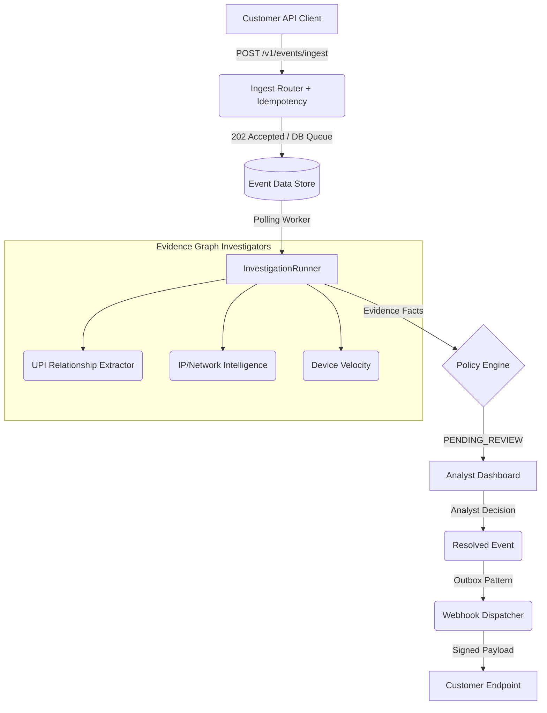

<div align="center">
  <h1>🛡️ RiskPilot AI</h1>
  
  **RiskPilot recommends. The analyst decides.**
  
  *RiskPilot is an independently testable payment-risk infrastructure prototype demonstrating deterministic risk assessment, concurrency-safe idempotency, reliable webhook delivery, UPI abuse detection, tenant isolation, and measurable analyst time savings.*

  [](https://www.python.org/)
  [](https://fastapi.tiangolo.com/)
  [](https://reactjs.org/)
  [](LICENSE)
</div>

<hr/>

## 📖 What is RiskPilot?

Fraud and risk analysts spend significant time manually gathering evidence across multiple systems before making a decision. 
RiskPilot automatically gathers and correlates investigation evidence, applies deterministic risk scoring and policy rules, and presents the result to a human analyst through an AI Copilot.

This prototype validates the core backend resilience required for a payment intelligence platform before introducing heavier tools like Kafka or Kubernetes.

✨ **The 7 Architectural Invariants:**
1. **Never block the ingest API:** Ingestion must accept events in < 50ms and return 202 Accepted.
2. **Idempotency is concurrency-safe:** Identical payloads arriving simultaneously must yield exactly 1 investigation.
3. **Decoupled investigation worker:** Investigations run asynchronously, isolated from the web server.
4. **Deterministic evidence:** The `RuleEvaluator` only acts upon cryptographically hashed, reproducible facts.
5. **Decoupled webhook delivery:** Downstream event propagation uses a strict outbox pattern with exponential backoff.
6. **Strict tenant isolation:** Risk models, rules, and events are strictly isolated by API key bounds.
7. **Human-in-the-loop:** The system aggregates risk, but high-severity cases block on explicit analyst approval.

---

## 🏗️ Architecture Flow



---

## 🚀 Quick Start & Evaluation Guide

RiskPilot has been engineered to be independently verified by technical evaluators.

### 1. One-Command Setup
We provide a single bootstrap script for Windows PowerShell that initializes the database, starts the API, starts the background workers, and spins up the React Dashboard automatically.

```powershell
.\start-demo.ps1
```

### 2. The Golden Evaluation Flow
To evaluate the end-to-end functionality of the system—from a synthetic API ingestion to the detection of a UPI abuse ring and outbox webhook delivery—run the customer simulator:

```powershell
.\run-evaluation.ps1
```
This will trigger the synthetic "UPI Ring" attack scenario, generating deterministic risk signals that you can immediately observe in the dashboard.

### 3. Verify the Engineering Claims
See the **[EVALUATION.md](EVALUATION.md)** artifact for explicit commands to verify idempotency, webhook reliability, isolation, and deterministic reproducibility in the Chaos Lab.

---

## 📊 The Technology Stack

| Component | Technology | Description |
|-----------|------------|-------------|
| **API Layer** | FastAPI + Pydantic | High-performance async ingestion |
| **Worker Engine** | AsyncIO + Python | Reliable background polling mechanism |
| **Database** | SQLite + SQLAlchemy | Strict relational data models |
| **Dashboard** | React + Vite | Clean, component-based Analyst UI |
| **Chaos Lab** | Pytest + httpx | Infrastructure resilience verification |

---

<div align="center">
<i>Built for the modern risk analyst.</i>
</div>
